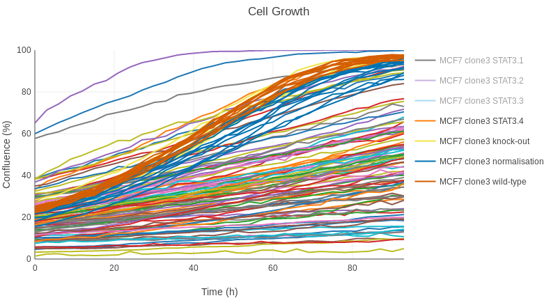
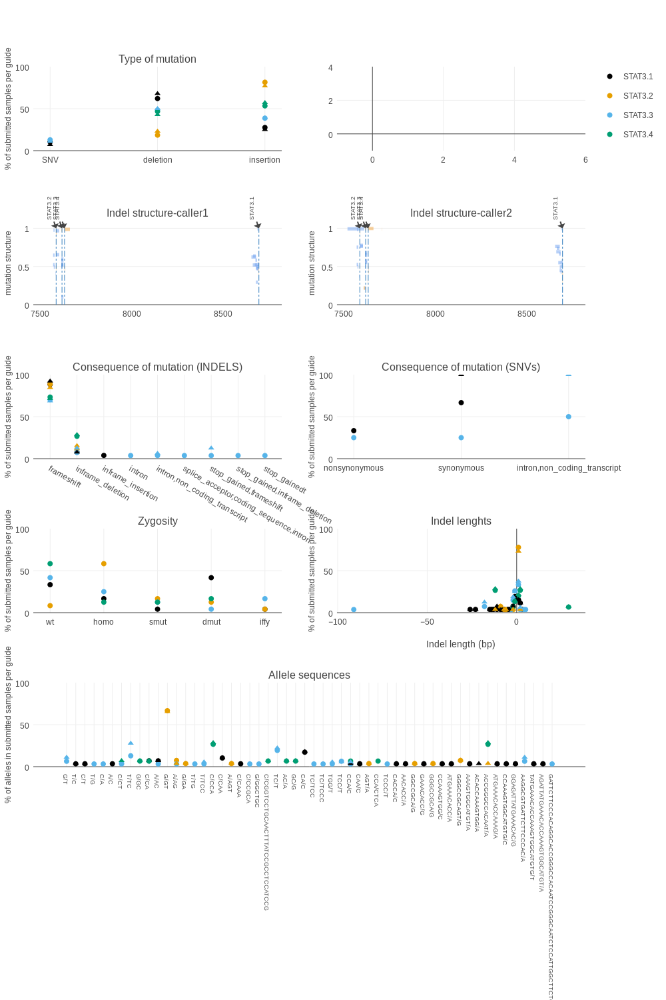
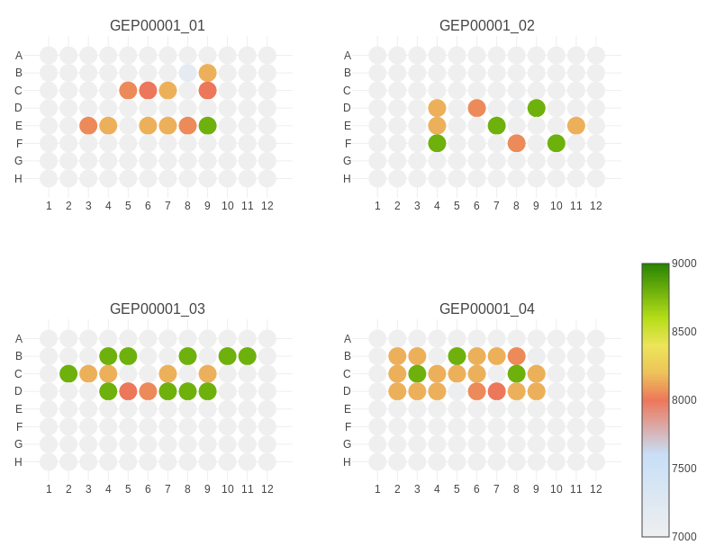

```{r setup, include=FALSE}
knitr::opts_chunk$set(echo = TRUE)
```

# Documentation of the Genome Editing plot outputs  

## Protein plot:  
This plot shows the IncellWestern 800nm/700nm ratios, with guides and controls one column each in the x-axis. Each dot corresponds to a single well. 


## Growth plot:  
This plot shows IncuCyte data as growth curves, mapping colours to guides and controls. Each line corresponds to a single well.  


### Slopes plot  
When the growth slopes can be calculated, this plot shows the values with guides and controls one column each in the x-axis. Each dot corresponds to a single well. 

## Combined data plots:  

### Global heatmap
This heatmap shows an overview of the whole experiment, depicting (in columns and one clone per row) protein amounts (800/700 ratios), NGS genotyping (frameshift to frame 2-3 and no frameshift | presence of off-targets | zygosity of the mutation) and Growth slope.  

### Global protein + slopes + NGS plot  
A combination of protein ratios (xaxis), growth slopes (yaxis) and NGS genotyping (zygosity and frameshifts) on a per-guide basis.  

## NGS plots:
These (except the *INDEL structre* plot) are experiment-wide exploratory plots, that will provide information about zygosity frequencies, alleles, indel sizes, etc., and show if different guides result preferences for certain types of mutations. The sgRNA guides are represented independently (in this case, STAT3.1 to 3.4).  


### Type of mutation  
This plot shows the *% of alleles that have a mutation of a certain type*. It shows allele data from all samples that have a mutation (so wt are excluded, and double and single mutants contribute with two and one alleles respectively). The types of mutation considered are *insertion*, *deletion* and *SNV* (single-nucleotide variant).  

### INDEL structure
These plots show an overview of position, size, allele frequency and type of mutation (INDEL/SNV) of all the clones in the experiment. Currently, Vardict and HaplotypeCaller are used.   

### Consequence of mutation  
These are two plots, one for INDELs and the other one for SNVs, that show the *% of submitted samples on a per-guide and per-allele basis* that have the same variant (frameshift, inframe-deletion, synonymous mutation...). The results are the % of alleles in the samples that show mutations (i.e. the wild-types are not included).

### Zygosity  
This plot shows the *% of samples submitted for NGS on a per-guide basis*. I.e. if you submit 100 samples for NGS and only 80 of them are edited, this plot will show a 20% of wild-types and the corresponding percentages of INDELS (not considering SNVs for this plot). These mutations can be:  
*wt*. Wild-type, no mutation.  
*homo*. Homozigous (biallelic) mutation. Called when allele_fraction > 0.85 and there is only one mutation in the variants output.  
*dmut*. Double-mutant, i.e. both alleles have at least a mutation and they are different. Called when allele fraction is between 0.35 and 0.85.  
*smut*. Single-mutant, i.e. only one allele is mutated with allele fraction between 0.35 and 0.85.  
*iffy*. Uncertain mutation, which can be e.g. a case with allele fraction >0.85 but two mutations (note that this could happen e.g. if the same allele is mutated in two positions, because allele fractions are computed per position, not per allele), or a case where allele_fraction is < 0.35.  
*warn*. A warning when the number of mutations (mutated positions) is not the same as the number of variants.  

### Indel lengths  
This plot shows the *% of samples submitted for NGS on a per-guide and per-allele basis*. It represents the percent of alleles that have an indel of the same length.

### Allele sequences  
This plot shows the *% of samples submitted for NGS on a per-guide and per-allele basis*. It represents the percent of alleles with a certain sequence of indel or SNV.  

## 96-well plate plot  
This plot shows the plates in the experiment, colour-coding the wells accordingly to the scoring system, to suggest the highest-scored clones for selection.  
