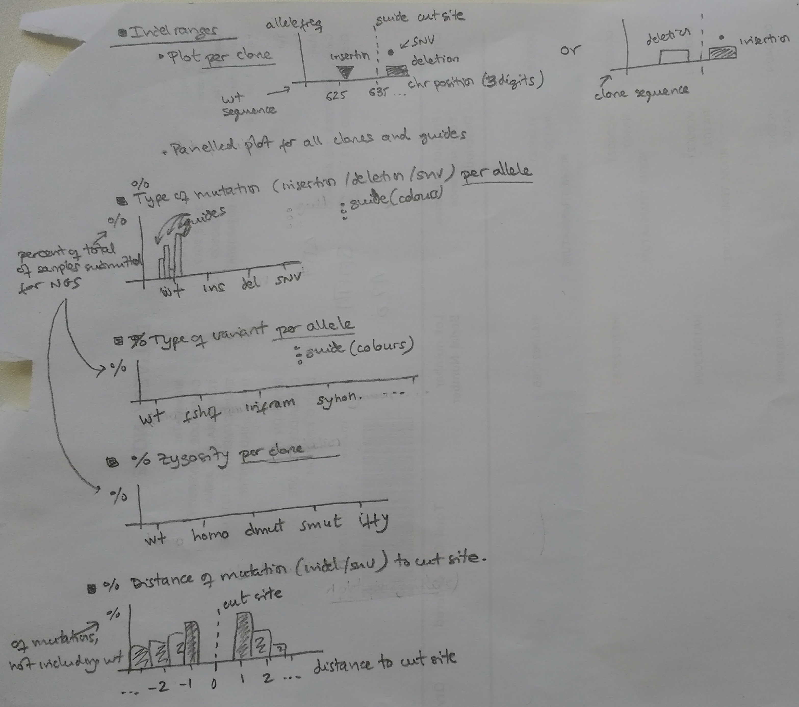

# NGS Downstream processing and plotting

## Variant categories and scoring system

We select only INDEL variants that have an allele_fraction above 0.1, and only select the ones which are within the amplicon range. If other variants are found, they will not be consider to categorise the mutation, these will be set as 'warn' for warning.
- if only one variant, and allele_fraction > 0.85 then zygosity is set to 'homo' for homozygous
- if only one variant, and 0.35 < allele_fraction < 0.85 then zygosity is set to 'smut' for one single mutation on only one chromosome, none on the other (het)
- if only one variant, and allele_fraction outside these above ranges then zygosity is set to 'iffy' for cases that are uncertain
- if two variants, and both 0.35 < allele_fraction < 0.85 then zygosity is set to 'dmut' for different mutation on each chromosome
- if two variants, and allele_fraction outside the above range then zygosity is set to 'iffy'
- if more than two variants, then zygosity is set to 'iffy'

We do also characterise if the above zygosity has been set only for one caller, or for both.
- if the same zygosity has been set for both VarDict and HaplotypeCaller, set to 'VH'
- if only found in VarDict, set to 'V-'
- if only found in HaplotypeCaller, set to '-H'
- otherwise set to 'V?'

Then a weighted score is calculated, 70% for has_off_target, 10% for consequence, and 10% for zygosity (10% for protein 800/100 ratio - not implemented yet).
- if the zygosity is set to 'warn', the score is zero
- if variant is off target, 70*100 is added to the score
- if the consequence of the variation is a frameshift, 10*100 is added to the score
- if the zygosity is 'dmut', 10*80 is added to the score
- if the zygosity is 'homo', 10*15 is added to the score
- if the zygosity is 'smut', 10*5 is added to the score

For more details, see code in `python/dnascissors/loader.py` which is located in three methods called `_characterise_mutations_`, `_characterise_variant_caller_presence` and `_get_score_`.

## Result table, one per sample

- Protein data as main score
- Base calculation on allele frequency, distance does not matter much

* Group them by sample
* If off target - down score strongest down
* If allele fraction between 0.4 0.6 for two of them

### zygosity column (and zygosity description in separate table?)

Use calczygosities function in NGS_plot.R script
Only work for two alleles - if more marked as more than 2 alleles
Filter out completely 0.15 now added into the pipeline

This function assesses the sample to decide whether their mutations are:
- homozygous (homo),
- one allele 'mutant' and the other a different mutant (muthet), or
- one allele mutant and the other wild-type (mutwt).
This may need to be adapted for cases with >2 alleles.

in the range of the amplicon, calculated per caller:
- 'homo' = allele_fraction > 0.85        & nb_row == 1 same mutation on both chromosomes
- 'smut' = 0.35 < allele_fraction < 0.85 & nb_row == 1 single mutation: mutation on only one chromosome, none on the other (het)
- 'dmut' = 0.35 < allele_fraction < 0.85 & nb_row == 2 double mutations: different mutation on each chromosome
- 'iffy' = full of uncertainty, for all others cases that are uncertain

NOT FOR NOW:- 'mult' =                                 nb_row > 2  multiple alleles: more than two rows
Category for each variant callers, and only looks at indels

### has_off_target column

gene not the target or position outside the range of the amplicon
- 'offt' = offtargets                                  mutation off target

### mutation_type column
join consequence from different rows of same sample
create 4 or more letters code for consequence:
- see fun.NGS_plotvariants

Create a result table for each sequencing sample

## Plots

### Indel ranges plot (Ruben)

issue with box size that needs to be calculated from position and indel length (positive: insertion with triangle bottom or negative: deletion with rectangle on top)

### Indel length distribution plot (On going)

per allele per variant caller
plotting percentage of indel_length based on cut site

See script `python/scripts/plot_distances_ongoing.py`

### Mutation plot (replace it by Allele plot) (Anne)

percentage of number of INDEL or SNV over total number of mutation found
info from type column, separated per guide (each guide has one colour)
per variant caller

three categories: SNV, Insertion (INDEL, positive), Deletion (INDEL, negative)

### Allele plot (Anne)

based on alleles column per caller and guide

### Variant plot (On going)

based on consequence
per allele over total number of mutation
per variant caller

See script `python/scripts/plot_typeofvariant_ongoing.py`

### Zygosity plot (Done)

per variant caller

See script `python/scripts/plot_zygosities.py`

### Plot diagrams

Plots are:
- 
- 
