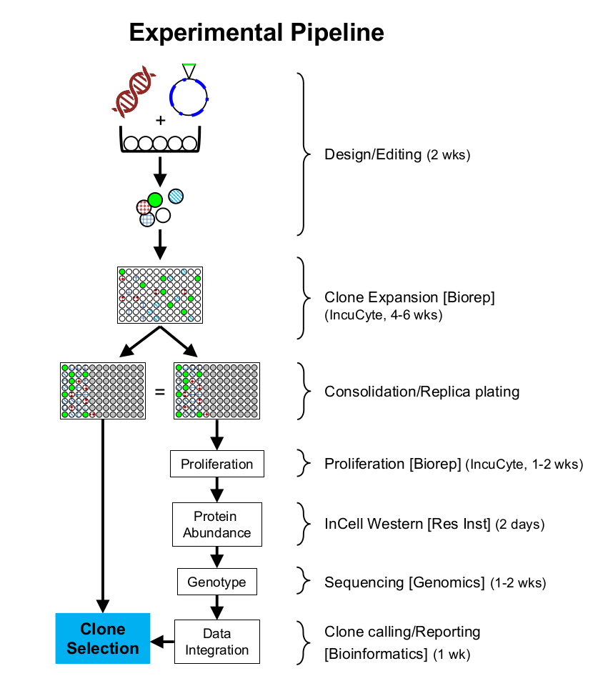

# Project Description

## Project outlines

### Steps

1. DeskGen: sgRNA guides and cut site coordinates (for targets an off-targets).
1. Manual primer design (primerBLAST. 250 bp max amplicon size).
1. Extract amplicons for NGS data alignments, using coordinates (fixed-size amplicons of e.g. 300 bp) or primer-defined amplicons.
1. Wet lab work.
1. Proliferation curves (confluency vs. time)
1. Proliferation ratios (slopes of curves)
1. Protein abundance
1. Identify KO’s, Knock-downs and overexpressors (using controls as reference)
1. Call indels and identify alelles
  - nucleotide alignments
  - aa alignments
1. Integration, clone selection based on user preferences

### Data inputs

- Sanger sequencing of the target region for each sgRNA in the parental line (this is to verify that there are no SNPs or mutations before designing the sgRNAs). This will be also used as reference, and should match the NGS of the Control (parental line), facilitating detection of potential contaminations (e.g. spillages of cells from one well, or potential mixing of cell lines on the bench).
- IncuCyte (growth)
- In-cell Wester (ICW, protein abundance)
- NGS
- ... (modular)

### Needs

- project requests (assign users, codes, etc). Website?
- project logging and tracking
  - Filenames (project, layout, IncuCyte, ICW, cell Controls) conventions
  - Clone tracking across the project
  - Searchability: e.g. ‘look up gene X in Projects with cell lines A, B, C’
 - Modular system (we have IncuCyte, ICW and NGS. Each module can give more than one group of data -e.g. we use the ICW with two colours but more could be added-. Also, each module should be able to function independently (e.g. we might not do ICW and should be able to integrate NGS and IncuCyte).
 - Normalisation between plates in the same experiment. Possibly normalisation between different projects?

## In-Cell Western: destructive quantitative immunofluorescence analysis of protein abundance or protein modifications

[https://www.licor.com/bio/applications/in-cell_western_assay/](https://www.licor.com/bio/applications/in-cell_western_assay/)

Features:
The assay works like this: a target is detected by a specific primary antibody, which is detected by a secondary antibody conjugated to a fluorescent dye. This way the same conjugated secondary antibody can be used in different assays.
- cells fluoresce at 700 nm (red)
- the target fluoresces at 800 nm (green)
- the relative protein abundance is expressed as 800nm/700nm
- a Control 2nd antibody only shows background target detection noise (a KO should have a 800/700 similar to this control)
- a Control no antibodies shows background noise (700nm can be used to filter empty wells. 800/700 is not meaningful)

**Needs:**
- data upload: ICW is not currently online
- visualisation:
  - Plot 800/700nm vs sgRNA
  - Show ICW plate wells linked to above plot data points (as a visual confirmation of ratio numbers).
- manipulation:
  - Ideally hover/click events on plot points show wells on plates, and areas can be zoomed in with the mouse. Tick-click to switch between images of 800/700 and 700 only.
  - (the ones below are also required for IncuCyte):
    - User-selected upper and lower thresholds for protein relative abundance (800/700)
    - tick-select of cell lines on a plot selects them from a table in another frame, and vice-versa (this is for data integration)
    - pointer hover/click shows data (cell line, position in the plate, value, experiment. Ideally, this could be configured to select which data to show)
- processing:
  - Inter-plate normalisation. Each plate has Controls always in the same position.
  - We are using two colours (800 and 700), but leave room so more colours can be used
  - Automatic filtering:
    - Draw e.g. a confidence interval around the values of the Controls (wt and KO), so the user can interpret whether cell lines are similar or different to the Controls.
    - Use 700nm values to filter out cells below a threshold (i.e. wells that are empty or with too few cells. This filter should be independent to the IncuCyte minimum growth ratio filter, so data can be processed independently).

## IncuCyte: real-time quantitative analysis of cell growth

[http://www.essenbioscience.com/en/products/IncuCyte/](http://www.essenbioscience.com/en/products/IncuCyte/)

Features:
- it takes photos of the wells and measures the area occupied by cells (we can call it ‘percentage of confluence’, which goes from 0 -no area- to 100 -whole well occupied by cells).
- the system supports HD phase-contrast, green fluorescence and red fluorescence automated imaging modes.
- online access
- managed by Bob at the Biorepository
- it can be used to verify monoclonality (clones originating from a single cell. There is integrated software for this).

**Needs:** system to upload IncuCyte data to the App, or system to use the App to retrieve IncuCyte data directly

- data visualisation:
  - growth curves (Confluence (%) vs. time (h))
  - growth rates (calculate slopes of the growth curves) (Rate vs sgRNA)
- data manipulation:
  - select the Controls (e.g. ‘Control parental line’, ‘Control KO’), the sgRNA’s and the Projects (therefore we could merge different Projects to integrate and compare data) to visualise.
  - Manual upper and lower thresholds for Confluence (%) and growth rates (so the user can filter out cell lines. This cannot be automatic because sometimes one will be interested in e.g. slow growers, but other times could be interested in faster growers).
  - lick-select of cell lines on a plot selects them from a table in another frame, and vice-versa. This is used for data integration.
  - pointer hover shows data (cell line, position in the plate, value, experiment. Ideally, this could be configured to select which data to show)
- data processing:
  - Inter-plate normalisation. Each plate has Controls always in the same position.
  - We are using phase-contrast to evaluate confluence, but leave room so other detection systems can be used
  - Automatic filtering:
    - Draw a confidence interval around the values of the Controls, so the user can interpret whether cell lines are similar or different to the Controls.

## NGS: amplicon sequencing and variant calling

**Needs:** processing pipeline

- data visualisation:
  - Nucleic acid alignments of cell clones against Control (parent. If a parent is not available, against the corresponding amplicon in the genome)
  - Amino-acid alignments of translated sequences to Control (or genome)
  - Grouping in:
    - Silent mutations (note potential change in codon usage and protein abundance)
    - Frame-shifts
    - In-frame mutations
    - Unchanged (grey out or discard)
    - QC of the data
- data manipulation:
  - tick-select of groups or cell lines (for data integration)
  - table shows data (cell line, position in the plate, value, experiment. Ideally, this could be configured to select which data to show)
  - tick shows data integration (see Data integration slide).
- data processing:
  - Naming convention for the Control (parent line; maybe in replicates?) to run pipeline automatically
  - Allow grouping of clones with same alignments, treat them as bioreps (for integration with IncuCyte and ICW)
- to bear in mind:
  - base transitions in formaldehyde-treated samples
  - we have biallelic cases, but also tri- or multiallelic (note for making consensus sequences)

## Data integration

**Needs:** integration of all modules for informed decisions on clones. Great ideas.

- data visualisation:
  - For selected lines,
    - **show info from independent modules**:
      - IncuCyte growth rate (slope)
      - ICW protein relative abundance (800/700) and nt and aa alignments
      - values of the Control (parent) and the Control KO (ICW no secondary antibody; this applies only to the ICW)
      - ID of the cell clone: Experiment, Plate, Position, parental cell line name.
      - (Possibly table and reuse of plots?)
    - **show integrated info** (this is the added value of the pipeline):
      - e.g. plot relative abundance (800/700) vs slope, slope vs. genotype (homozygote wt and mutant, heterozygote, and multiallelic combinations of heterozygotes; plus silent mutation, in-frame or frameshift mutation).
      - informative ways to integrate three or more dimensions? E.g. abundance vs slope, and different colours per genotype, spider plots if we have more data inputs?
      - e.g. Clustering/PCA to identify groups with different behaviours?
- data manipulation:
  - tick-select of groups or cell lines (for data integration)
  - Possibility to integrate several experiments (to see e.g. activity of a guide and enzyme across cell lines
- data processing:
  - Naming convention for the Control (parent; maybe in replicates?) to run pipeline automatically
  - Grouping of clones with same alignments, treat them as bioreps (for integration with IncuCyte and ICW)
